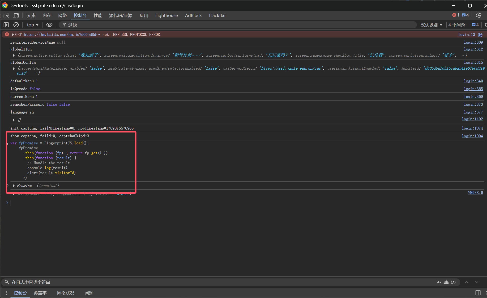
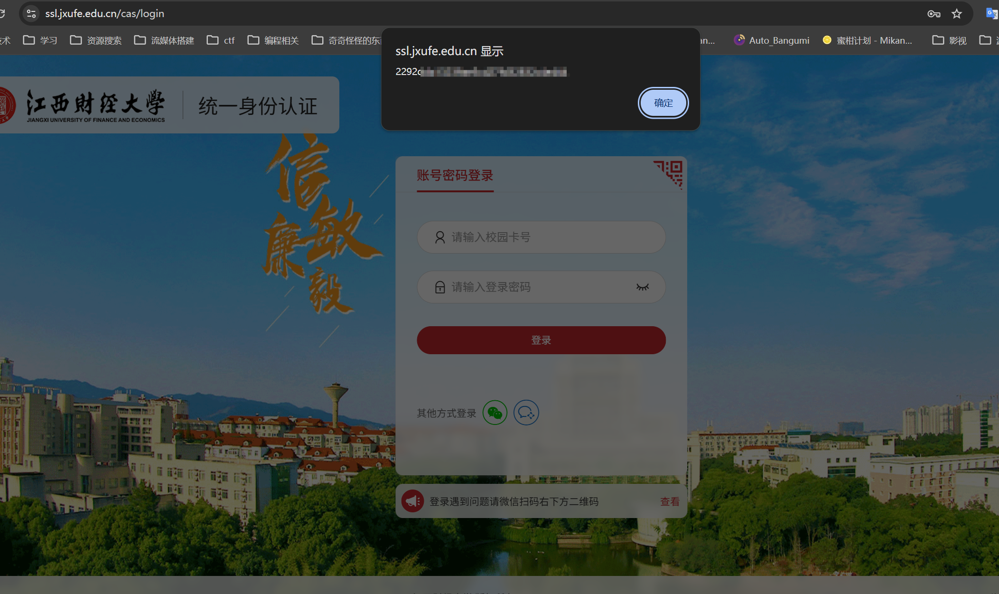

# KingosoftGradePush

一个用于自动获取教务系统（青果/Kingo系统，适配江西财经大学）成绩并推送通知的 Python 工具。


## 环境要求

- **Python** 3.10+
- **Node.js** (必须安装，用于 `execjs` 执行 JS 加密脚本)

## 安装依赖


```bash
pip install requests beautifulsoup4 PyExecJS
```

自行安装`Node.js`

## 配置文件

在项目根目录下创建一个 `config.json` 文件（可以参考 `config.json.example`）。

**config.json 格式：**

```json
{
    "baseUrl": "服务器地址",
    "username": "学号",
    "passwordMd5": "密码的md5值",
    "token": "ShowDoc推送token值",
    "login_way": 0,
    "password": "江财oa密码",
    "fpVisitorId": "已认证浏览器指纹"
}
```
其中， login_way的值为0则使用喜鹊儿登录为1则使用江财oa登录

**字段说明：**

- `baseUrl`: 教务系统首页地址。
- `username`: 学号 (必须为纯数字)。
- `passwordMd5`: 教务系统密码的 **MD5 哈希值** (必须是 32 位小写字母)。
  - *提示：你可以使用在线 MD5 工具将你的明文密码转换为 32 位小写哈希值。*
  - eg:站长工具[https://tool.chinaz.com/tools/md5.aspx](https://tool.chinaz.com/tools/md5.aspx)
- `token`: 消息推送服务的 Token (不能为空)。
- `long_way`: 值为0则使用喜鹊儿登录为1则使用江财oa登录
- `password`: 江财统一登陆密码
- `fpVisitorId`: 江财统一登陆浏览器指纹,确保该浏览器可以登录江财统一认证中心

## fpVisitorId获取

`fpVisitorId`是浏览器指纹，所以请确保你使用的浏览器可以登录江财统一认证中心，推荐在尝试之前自行登录
首先访问江财统一身份认证[https://ssl.jxufe.edu.cn/cas/login](https://ssl.jxufe.edu.cn/cas/login)

输入账号密码后登录，确保登录,当弹出需要认证的时候，请选择记住设备并扫码。确保登录成功后退出登录
随后准备获取`fpVisitorId`
以`Google Chrome`为例
对着网页右键-检查-控制台
复制下方代码到控制台中后回车
```js
var fpPromise = FingerprintJS.load();
    fpPromise
      .then(function (fp) { return fp.get() })
      .then(function (result) {
        // Handle the result
        console.log(result)
        alert(result.visitorId)
      })
```


网页中就会弹出`fpVisitorId`，将其填入配置文件中即可



## 推送Token获取
推送服务使用的是ShowDoc，请自行注册
[https://push.showdoc.com.cn/#/](https://push.showdoc.com.cn/#/)

## 使用方法

```bash
python main.py
```
如果是linux环境，请确保`jkingo.des.js`可执行
```bash
chmod +x jkingo.des.js
```

由于我校屏蔽了国外的ip访问教务平台，故没有配置Github Action,请自行准备**国内服务器**做托管

### linux

linux推荐使用`Crontab`定时执行推送服务

请确保`jkingo.des.js`可执行
```bash
chmod +x jkingo.des.js
```

请确保你已安装`Node.js`

**ubuntu/debian**
```bash
sudo apt install nodejs
```

在配置之前请确保以下命令能在正确执行，下方路径请改成你本地的路径

```bash
cd ~&&/home/user/GradeEasyPush/venv/bin/python3 /home/user/GradeEasyPush/main.py
```

如果能正常运行，可以按照以下方式配置`Crontab`

```bash
crontab -e
```
添加以下一行配置：
```
*/30 * * * * /home/user/GradeEasyPush/venv/bin/python3 /home/user/GradeEasyPush/main.py >> /home/user/GradeEasyPush/cron.log 2>&1
```

**注意自行替换路径**


## 免责声明

本项目仅供学习和交流使用。请勿用于非法用途或频繁请求对教务系统造成压力。开发者不对使用本工具造成的任何后果负责。

## 致谢
- [XiQueEr2Ics](https://github.com/shutdown-awa/XiQueEr2Ics)
- 等等..

Copyright © 2026 [qiuyuyang](https://www.amqyy.cn/). All rights reserved.